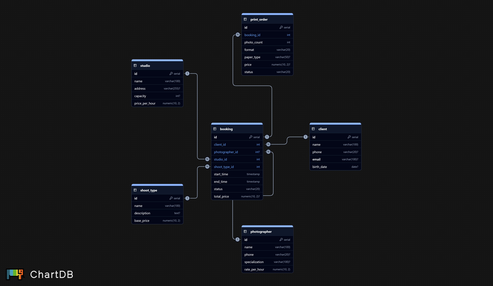

# Фотостудия – база данных

## Описание проекта
База данных для фотостудии, содержащая информацию о клиентах, фотографах, видах съёмок, студиях, бронированиях и заказах на печать.

## ER-диаграмма

## Скрипты
- `schema.sql` – создание таблиц.
- `seed.sql` – тестовые данные (клиенты, фотографы, бронирования и пр.).
- `queries.sql` – примеры SELECT-запросов.

## Как развернуть (PostgreSQL)
1. Установите PostgreSQL и создайте базу данных `photostudio`.
2. Выполните скрипт `schema.sql` для создания таблиц.
3. Выполните `seed.sql` для заполнения тестовыми данными.

## Связи между таблицами
- `booking` ссылается на `client`, `photographer`, `studio`, `shoot_type`.
- `print_order` ссылается на `booking`.

## Автор
[Усманова Н]
